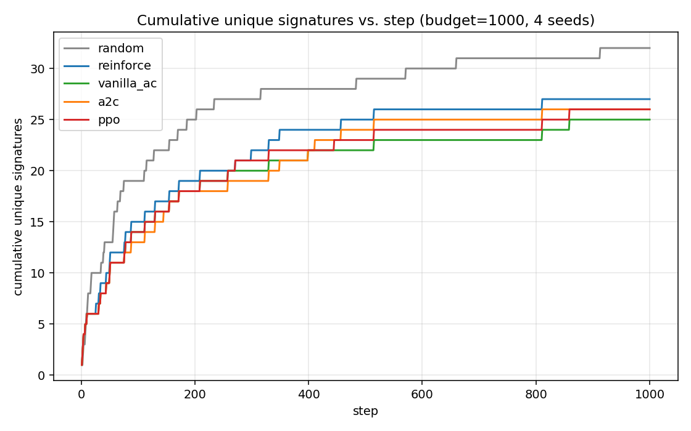
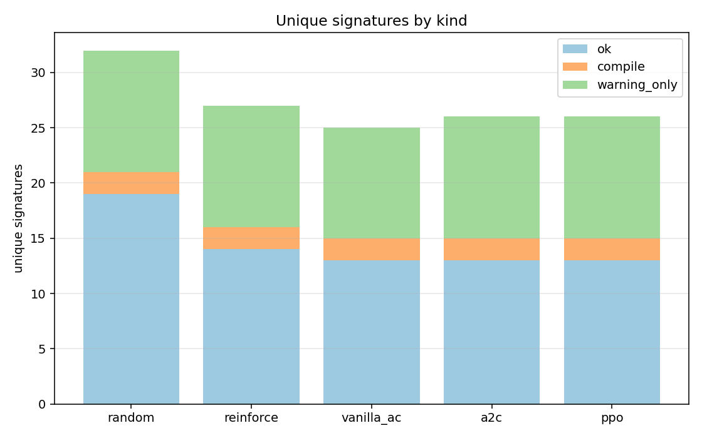
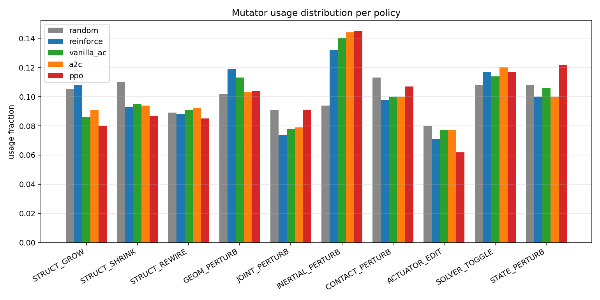
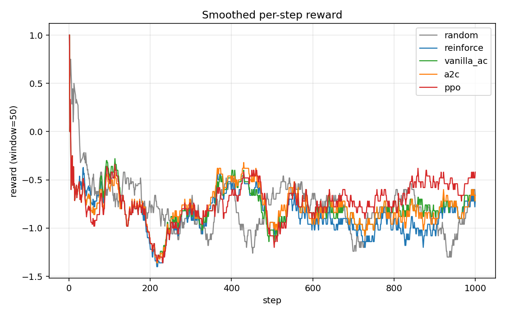

# MJ-Fuzz benchmark report

- Budget per policy: **1000**
- Seeds: pendulum, double_pendulum, box_stack, slider_crank
- MuJoCo: 3.2.3   |   PyTorch: 2.4.1+cpu   |   Python: 3.8.6
- Subprocess-isolated executor; reward & triage per `configs/default.yaml`.

## 1. Algorithms compared

| Policy | Family | One-line description |
|---|---|---|
| `random` | Random baseline | Uniformly samples (mutator, param_seed, rollout_bucket). No learning, no state — pure exploration baseline. |
| `reinforce` | REINFORCE (Williams 1992) | Monte-Carlo policy gradient with batch-mean baseline. Uses the value head only as a constant baseline; full-episode returns; high variance. |
| `vanilla_ac` | Vanilla 1-step Actor-Critic (GzFuzz-style) | TD(0) bootstrap: delta = r + gamma*V(s') - V(s). Single gradient step per buffer flush; no minibatching, no trust region. The simplest 'real' AC. |
| `a2c` | A2C (synchronous N-step) | N-step return + advantage normalization + global-norm clip. One gradient step per rollout flush. |
| `ppo` | PPO + GAE (Schulman 2017) | Clipped surrogate objective (eps=0.2), GAE(lambda=0.95), 4 epochs over MB=32 — recommended main algorithm. |

## 2. Headline results

| Policy | raw | unique | ok | compile | warning_only | elapsed (s) | unique/min |
|---|---|---|---|---|---|---|---|
| `random` | 1000 | **32** | 19 | 2 | 11 | 845.2 | 2.27 |
| `reinforce` | 1000 | **27** | 14 | 2 | 11 | 863.0 | 1.88 |
| `vanilla_ac` | 1000 | **25** | 13 | 2 | 10 | 774.3 | 1.94 |
| `a2c` | 1000 | **26** | 13 | 2 | 11 | 764.9 | 2.04 |
| `ppo` | 1000 | **26** | 13 | 2 | 11 | 788.4 | 1.98 |

## 3. Plots

### 3.1 Cumulative unique signatures vs. step

### 3.2 Unique signatures by kind

### 3.3 Mutator usage distribution

### 3.4 Smoothed reward (window=50)

## 4. Top-10 signatures per policy

### `random`

| sig | count | kind | exception | warnings |
|---|---|---|---|---|
| `4264c9ff2dddb8a9` | 215 | compile | ValueError | - |
| `1520f695677ceb55` | 151 | ok | - | - |
| `bbe5679e5702ef0e` | 138 | ok | - | - |
| `5fe8fe8f33214448` | 130 | ok | - | - |
| `695d0a5661b434bf` | 129 | ok | - | - |
| `bd80aba6ed3adc02` | 68 | compile | MutationSkip | - |
| `1073671ad6875cc2` | 44 | ok | - | - |
| `63a371998f08cb27` | 14 | ok | - | - |
| `f1f311bb810c7922` | 13 | ok | - | - |
| `901c58d73e000e7c` | 11 | ok | - | - |

### `reinforce`

| sig | count | kind | exception | warnings |
|---|---|---|---|---|
| `4264c9ff2dddb8a9` | 247 | compile | ValueError | - |
| `695d0a5661b434bf` | 142 | ok | - | - |
| `5fe8fe8f33214448` | 138 | ok | - | - |
| `1520f695677ceb55` | 136 | ok | - | - |
| `bbe5679e5702ef0e` | 128 | ok | - | - |
| `bd80aba6ed3adc02` | 59 | compile | MutationSkip | - |
| `1073671ad6875cc2` | 32 | ok | - | - |
| `63a371998f08cb27` | 23 | ok | - | - |
| `799d5109092171ce` | 14 | ok | - | - |
| `901c58d73e000e7c` | 11 | ok | - | - |

### `vanilla_ac`

| sig | count | kind | exception | warnings |
|---|---|---|---|---|
| `4264c9ff2dddb8a9` | 225 | compile | ValueError | - |
| `695d0a5661b434bf` | 148 | ok | - | - |
| `1520f695677ceb55` | 147 | ok | - | - |
| `5fe8fe8f33214448` | 142 | ok | - | - |
| `bbe5679e5702ef0e` | 133 | ok | - | - |
| `bd80aba6ed3adc02` | 57 | compile | MutationSkip | - |
| `1073671ad6875cc2` | 33 | ok | - | - |
| `63a371998f08cb27` | 23 | ok | - | - |
| `799d5109092171ce` | 18 | ok | - | - |
| `f1f311bb810c7922` | 12 | ok | - | - |

### `a2c`

| sig | count | kind | exception | warnings |
|---|---|---|---|---|
| `4264c9ff2dddb8a9` | 225 | compile | ValueError | - |
| `695d0a5661b434bf` | 147 | ok | - | - |
| `1520f695677ceb55` | 145 | ok | - | - |
| `5fe8fe8f33214448` | 141 | ok | - | - |
| `bbe5679e5702ef0e` | 133 | ok | - | - |
| `bd80aba6ed3adc02` | 57 | compile | MutationSkip | - |
| `1073671ad6875cc2` | 33 | ok | - | - |
| `63a371998f08cb27` | 22 | ok | - | - |
| `799d5109092171ce` | 17 | ok | - | - |
| `901c58d73e000e7c` | 12 | ok | - | - |

### `ppo`

| sig | count | kind | exception | warnings |
|---|---|---|---|---|
| `4264c9ff2dddb8a9` | 211 | compile | ValueError | - |
| `1520f695677ceb55` | 155 | ok | - | - |
| `5fe8fe8f33214448` | 150 | ok | - | - |
| `695d0a5661b434bf` | 150 | ok | - | - |
| `bbe5679e5702ef0e` | 148 | ok | - | - |
| `bd80aba6ed3adc02` | 53 | compile | MutationSkip | - |
| `1073671ad6875cc2` | 29 | ok | - | - |
| `63a371998f08cb27` | 17 | ok | - | - |
| `799d5109092171ce` | 13 | ok | - | - |
| `901c58d73e000e7c` | 11 | ok | - | - |

## 5. Notes

- `unique` = distinct issue signatures (blake2s of failure_kind+etype+first_warning+topology).
- `compile` includes `MutationSkip` (a structural mutation produced an invalid tree).
- `warning_only` is dominated by `BADQVEL` / `BADCTRL` from STATE_PERTURB injection.
- Same seed and same hyperparameters across all policies. See `configs/default.yaml`.