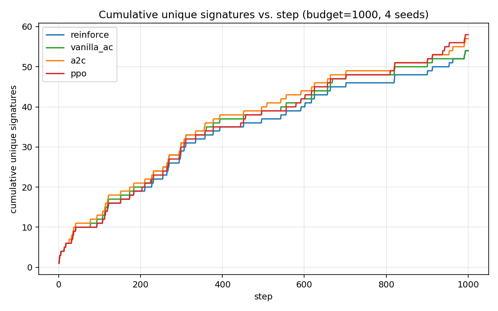
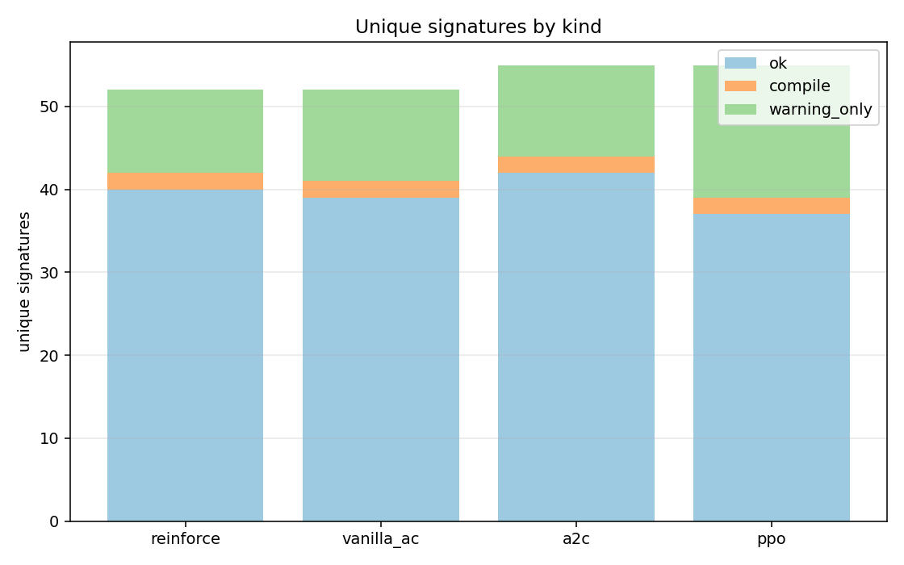
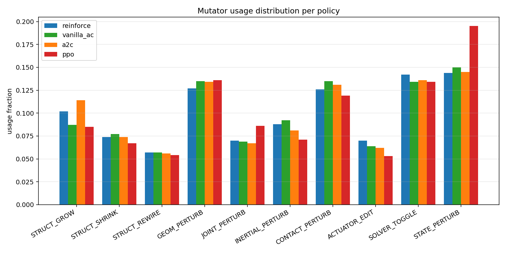
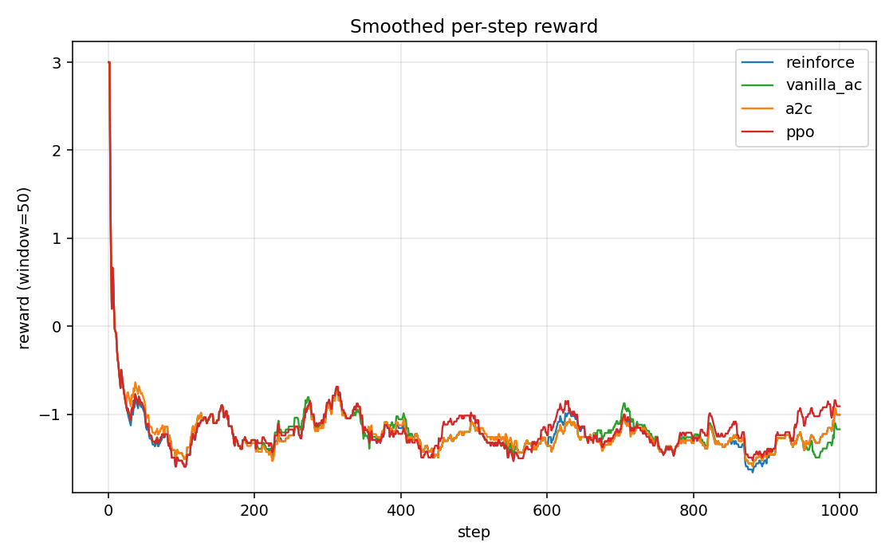

# MJ-Fuzz benchmark report

- Budget per policy: **1000**
- Seeds: pendulum, double_pendulum, box_stack, slider_crank
- MuJoCo: 3.2.3   |   PyTorch: 2.4.1+cpu   |   Python: 3.8.6
- Subprocess-isolated executor; reward & triage per `configs/default.yaml`.

## 1. Algorithms compared

| Policy | Family | One-line description |
|---|---|---|
| `reinforce` | REINFORCE (Williams 1992) | Monte-Carlo policy gradient with batch-mean baseline. Uses the value head only as a constant baseline; full-episode returns; high variance. |
| `vanilla_ac` | Vanilla 1-step Actor-Critic (GzFuzz-style) | TD(0) bootstrap: delta = r + gamma*V(s') - V(s). Single gradient step per buffer flush; no minibatching, no trust region. The simplest 'real' AC. |
| `a2c` | A2C (synchronous N-step) | N-step return + advantage normalization + global-norm clip. One gradient step per rollout flush. |
| `ppo` | PPO + GAE (Schulman 2017) | Clipped surrogate objective (eps=0.2), GAE(lambda=0.95), 4 epochs over MB=32 — recommended main algorithm. |

## 2. Headline results

| Policy | raw | unique | ok | compile | warning_only | elapsed (s) | unique/min |
|---|---|---|---|---|---|---|---|
| `reinforce` | 1000 | **54** | 40 | 2 | 10 | 1005.0 | 3.22 |
| `vanilla_ac` | 1000 | **54** | 39 | 2 | 11 | 957.4 | 3.38 |
| `a2c` | 1000 | **57** | 42 | 2 | 11 | 968.1 | 3.53 |
| `ppo` | 1000 | **58** | 37 | 2 | 16 | 935.8 | 3.72 |

## 3. Plots

### 3.1 Cumulative unique signatures vs. step

### 3.2 Unique signatures by kind

### 3.3 Mutator usage distribution

### 3.4 Smoothed reward (window=50)

## 4. Top-10 signatures per policy

### `reinforce`

| sig | count | kind | exception | warnings |
|---|---|---|---|---|
| `4264c9ff2dddb8a9` | 625 | compile | ValueError | - |
| `efc13de5c554fbd5` | 168 | ok | - | - |
| `bd80aba6ed3adc02` | 39 | compile | MutationSkip | - |
| `76d7c5e5e93daa24` | 29 | ok | - | - |
| `d353d1f84da11a44` | 12 | ok | - | - |
| `3e42bd6fa026ea1d` | 9 | ok | - | - |
| `da0213f205370433` | 9 | ok | - | - |
| `f60d4c1e03febaec` | 9 | ok | - | - |
| `7f3d6a7c4a6344a1` | 8 | ok | - | - |
| `36a89a10cc29d808` | 6 | ok | - | - |

### `vanilla_ac`

| sig | count | kind | exception | warnings |
|---|---|---|---|---|
| `4264c9ff2dddb8a9` | 617 | compile | ValueError | - |
| `efc13de5c554fbd5` | 171 | ok | - | - |
| `bd80aba6ed3adc02` | 41 | compile | MutationSkip | - |
| `76d7c5e5e93daa24` | 29 | ok | - | - |
| `d353d1f84da11a44` | 12 | ok | - | - |
| `3e42bd6fa026ea1d` | 9 | ok | - | - |
| `da0213f205370433` | 9 | ok | - | - |
| `f60d4c1e03febaec` | 9 | ok | - | - |
| `7f3d6a7c4a6344a1` | 9 | ok | - | - |
| `144959f36a777a8b` | 6 | ok | - | - |

### `a2c`

| sig | count | kind | exception | warnings |
|---|---|---|---|---|
| `4264c9ff2dddb8a9` | 627 | compile | ValueError | - |
| `efc13de5c554fbd5` | 170 | ok | - | - |
| `bd80aba6ed3adc02` | 38 | compile | MutationSkip | - |
| `76d7c5e5e93daa24` | 28 | ok | - | - |
| `d353d1f84da11a44` | 12 | ok | - | - |
| `3e42bd6fa026ea1d` | 9 | ok | - | - |
| `da0213f205370433` | 9 | ok | - | - |
| `f60d4c1e03febaec` | 8 | ok | - | - |
| `7f3d6a7c4a6344a1` | 8 | ok | - | - |
| `144959f36a777a8b` | 6 | ok | - | - |

### `ppo`

| sig | count | kind | exception | warnings |
|---|---|---|---|---|
| `4264c9ff2dddb8a9` | 607 | compile | ValueError | - |
| `efc13de5c554fbd5` | 175 | ok | - | - |
| `bd80aba6ed3adc02` | 42 | compile | MutationSkip | - |
| `76d7c5e5e93daa24` | 29 | ok | - | - |
| `3e42bd6fa026ea1d` | 13 | ok | - | - |
| `d353d1f84da11a44` | 12 | ok | - | - |
| `da0213f205370433` | 10 | ok | - | - |
| `f60d4c1e03febaec` | 7 | ok | - | - |
| `f6c1c0ffb7183256` | 7 | ok | - | - |
| `7f3d6a7c4a6344a1` | 7 | ok | - | - |

## 5. Notes

- `unique` = distinct issue signatures (blake2s of failure_kind+etype+first_warning+topology).
- `compile` includes `MutationSkip` (a structural mutation produced an invalid tree).
- `warning_only` is dominated by `BADQVEL` / `BADCTRL` from STATE_PERTURB injection.
- Same seed and same hyperparameters across all policies. See `configs/default.yaml`.