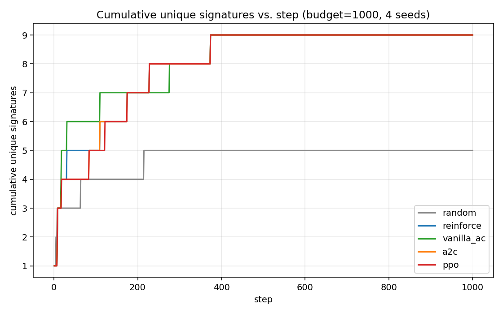
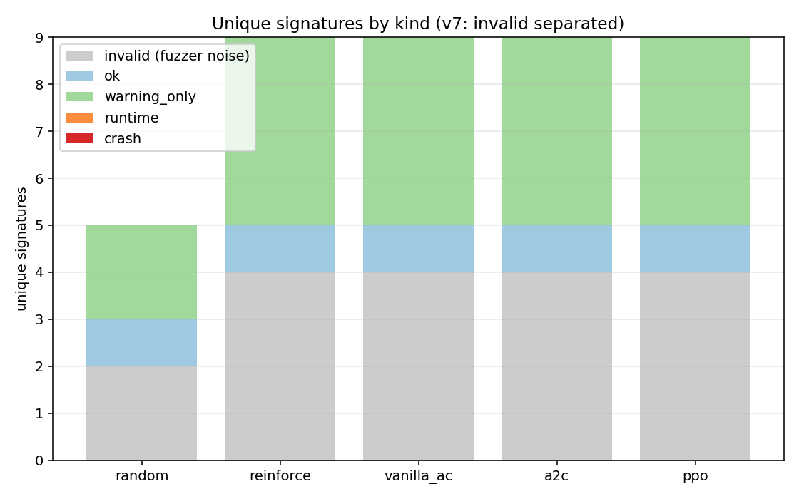
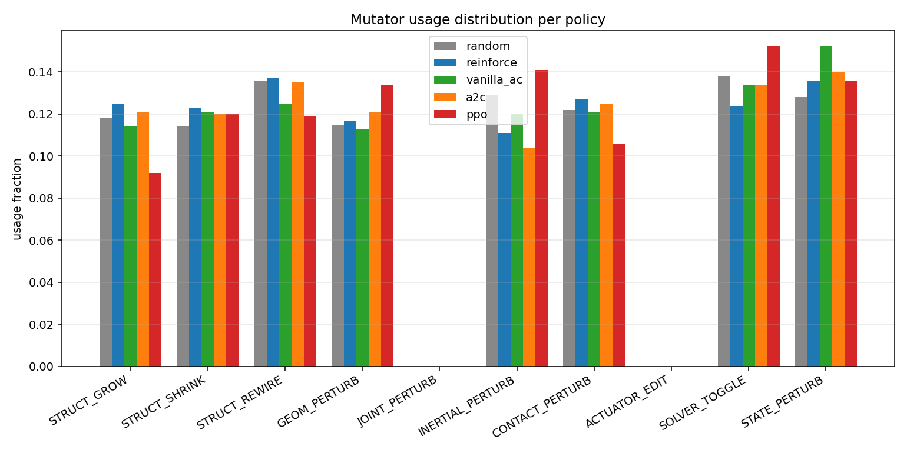
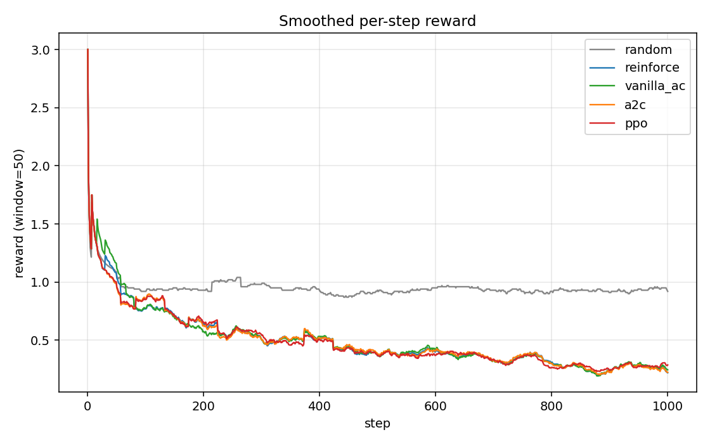

# MJ-Fuzz benchmark report

- Budget per policy: **1000**
- Seeds: pendulum, double_pendulum, box_stack, slider_crank
- MuJoCo: 3.2.3   |   PyTorch: 2.4.1+cpu   |   Python: 3.8.6
- Subprocess-isolated executor; reward & triage per `configs/default.yaml`.

## 1. Algorithms compared

| Policy | Family | One-line description |
|---|---|---|
| `random` | Random baseline | Uniformly samples (mutator, param_seed, rollout_bucket). No learning, no state — pure exploration baseline. |
| `reinforce` | REINFORCE (Williams 1992) | Monte-Carlo policy gradient with batch-mean baseline. Uses the value head only as a constant baseline; full-episode returns; high variance. |
| `vanilla_ac` | Vanilla 1-step Actor-Critic (GzFuzz-style) | TD(0) bootstrap: delta = r + gamma*V(s') - V(s). Single gradient step per buffer flush; no minibatching, no trust region. The simplest 'real' AC. |
| `a2c` | A2C (synchronous N-step) | N-step return + advantage normalization + global-norm clip. One gradient step per rollout flush. |
| `ppo` | PPO + GAE (Schulman 2017) | Clipped surrogate objective (eps=0.2), GAE(lambda=0.95), 4 epochs over MB=32 — recommended main algorithm. |

## 2. Headline results

**`real_findings` excludes fuzzer-internal `invalid` inputs (compile-time failures from malformed MJCF). `real_bugs` = testcases flagged by `SpontaneousNanOracle` (finite input → NaN/Inf or spontaneous BADQPOS/BADQVEL/BADQACC; not user-injected).**

| Policy | raw | real_unique | invalid | ok | warn | runtime | crash | real_bugs (raw / sig) | elapsed (s) |
|---|---|---|---|---|---|---|---|---|---|
| `random` | 1000 | **3** | 2 | 1 | 2 | 0 | 0 | 0 / 0 | 688.8 |
| `reinforce` | 1000 | **5** | 4 | 1 | 4 | 0 | 0 | 7 / 1 | 701.0 |
| `vanilla_ac` | 1000 | **5** | 4 | 1 | 4 | 0 | 0 | 8 / 1 | 698.7 |
| `a2c` | 1000 | **5** | 4 | 1 | 4 | 0 | 0 | 7 / 1 | 715.9 |
| `ppo` | 1000 | **5** | 4 | 1 | 4 | 0 | 0 | 9 / 1 | 705.5 |

## 3. Plots

### 3.1 Cumulative unique signatures vs. step

### 3.2 Unique signatures by kind

### 3.3 Mutator usage distribution

### 3.4 Smoothed reward (window=50)

## 4. Top-10 real-finding signatures per policy

*(`invalid` signatures — MutationSkip / compile failures from malformed MJCF — are excluded; they are fuzzer-internal noise, not MuJoCo bugs.)*

### `random`

| sig | count | kind | exception | warnings |
|---|---|---|---|---|
| `350939a8ea5e83af` | 831 | ok | - | - |
| `b2812039bb22d9a2` | 19 | warning_only | - | BADQVEL |
| `bd9d4a393bf5dd06` | 14 | warning_only | - | BADQPOS |

### `reinforce`

| sig | count | kind | exception | warnings |
|---|---|---|---|---|
| `350939a8ea5e83af` | 751 | ok | - | - |
| `b2812039bb22d9a2` | 44 | warning_only | - | BADQVEL |
| `bd9d4a393bf5dd06` | 7 | warning_only | - | BADQPOS |
| `59d8892d99f9bbaa` | 7 | warning_only | - | BADQACC |
| `f2c0f7691976d65d` | 5 | warning_only | - | BADCTRL |

### `vanilla_ac`

| sig | count | kind | exception | warnings |
|---|---|---|---|---|
| `350939a8ea5e83af` | 755 | ok | - | - |
| `b2812039bb22d9a2` | 46 | warning_only | - | BADQVEL |
| `59d8892d99f9bbaa` | 8 | warning_only | - | BADQACC |
| `bd9d4a393bf5dd06` | 6 | warning_only | - | BADQPOS |
| `f2c0f7691976d65d` | 5 | warning_only | - | BADCTRL |

### `a2c`

| sig | count | kind | exception | warnings |
|---|---|---|---|---|
| `350939a8ea5e83af` | 757 | ok | - | - |
| `b2812039bb22d9a2` | 42 | warning_only | - | BADQVEL |
| `59d8892d99f9bbaa` | 7 | warning_only | - | BADQACC |
| `bd9d4a393bf5dd06` | 6 | warning_only | - | BADQPOS |
| `f2c0f7691976d65d` | 5 | warning_only | - | BADCTRL |

### `ppo`

| sig | count | kind | exception | warnings |
|---|---|---|---|---|
| `350939a8ea5e83af` | 781 | ok | - | - |
| `b2812039bb22d9a2` | 36 | warning_only | - | BADQVEL |
| `59d8892d99f9bbaa` | 9 | warning_only | - | BADQACC |
| `f2c0f7691976d65d` | 4 | warning_only | - | BADCTRL |
| `bd9d4a393bf5dd06` | 3 | warning_only | - | BADQPOS |

## 5. Notes

- **`real_unique`** = ok + warning_only + runtime + crash + inconsistency. Invalid (compile-failures from malformed mutator output) are EXCLUDED and shown separately as `invalid` — they are not MuJoCo bugs.
- **`real_bugs`** comes from `SpontaneousNanOracle`: testcases where MuJoCo produced NaN/Inf/BAD-warnings WITHOUT us injecting NaN/Inf into the state. `raw` = #testcases, `sig` = #distinct signatures.
- Each step pre-compiles the mutated XML in the main process and resamples params up to N times if compile fails (GZFuzz-style validity gate, `run.validity_retries`). This collapses the old flood of trivial compile-fail signatures.
- See `outputs/real_bugs/*.json` for full diagnostics of each `real_bug_candidate` testcase.