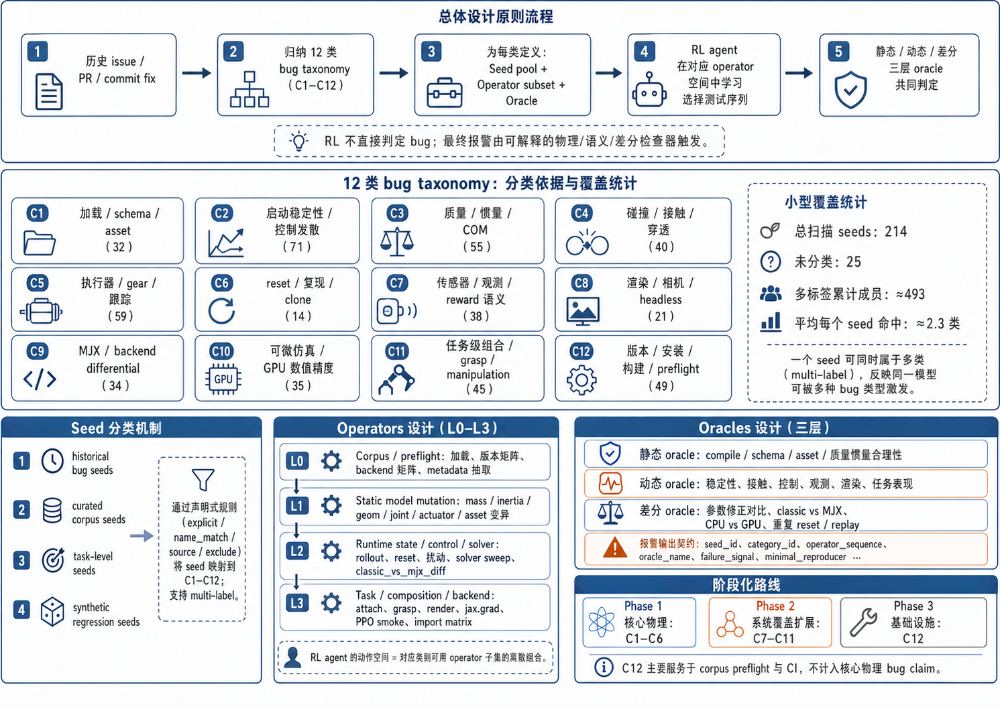

# MuJoCo Fuzz 2.0：12 类 Seeds 的分类依据、覆盖统计与 Operator/Oracle 设计

> 面向同行的精炼技术报告。对应实现：[seeds2/categories.yaml](../seeds2/categories.yaml)、[seeds2/MANIFEST.json](../seeds2/MANIFEST.json)、[seeds2/SUMMARY.md](../seeds2/SUMMARY.md)，分类标准来源于 [_docs/mujoco_bug_taxonomy_seed_operator_oracle.md](mujoco_bug_taxonomy_seed_operator_oracle.md)。

## 1. 总体设计原则

我们将 MuJoCo 上下游开源仓库（mujoco、mujoco_menagerie、dm_control、Gymnasium、Gymnasium-Robotics、robosuite、MyoSuite、MuJoCo Playground、MJX、mujoco_mpc 等）历史 issue / PR / commit fix 中真实出现过的模型与仿真缺陷进行归纳，得到 12 类 bug taxonomy（C1–C12）。每一类 bug 不共享同一个 oracle，而是定义自己的：

- **Seed pool**：能够稳定复现该类 bug 模式的 MJCF / 任务模型集合；
- **Operator subset**：用来在该类 seed 上施加扰动或组合的变换算子；
- **Oracle**：与该类 bug 真实失效现象一一对应的物理 / 语义 / 差分检查器。

强化学习模型不直接判定 bug，只在每类 operator 空间中学习选择更易暴露异常的测试序列；最终由静态物理一致性、动态 rollout、差分验证三层 oracle 共同判定。

## 2. 12 类分类依据

每类的“分类依据 = 真实历史失效模式 + 触发该模式所需的最小模型/系统特征”。

| ID | 类别（中文） | 分类依据（典型失效模式） |
|----|----|----|
| C1 | MJCF 加载 / schema / include / asset 引用 | 模型尚未进入动力学就失败，或不同解析器/版本对同一 MJCF / URDF / include / mesh 资产解释不一致 |
| C2 | 启动稳定性 / 默认控制器发散 | 模型可加载，但 zero-control / home-keyframe / 微小扰动下出现 CoM drift、振荡发散、摔倒、qvel/qacc spike |
| C3 | 质量 / 惯量 / COM / mass matrix | 质量、对角惯量、惯性坐标系、左右对称性或装配后的质量矩阵不合理（多为轻微受力下不合理动力学响应，而非 NaN） |
| C4 | 碰撞 / 接触几何 / 穿透 / contact force | 碰撞几何、contact pair、穿透深度、contact force、contact sensor 或后端在不同设置下不一致 |
| C5 | 执行器 / 控制范围 / gear / 力方向 / tracking | actuator target、ctrlrange、gear 符号 / 量级、肌肉或逆动力学 tracking 与期望语义不符 |
| C6 | 状态 reset / reproducibility / warm-start / clone | 同 seed / 同 state / 同 action 轨迹不一致；contact-rich 状态下 set_state 破坏物体；mocap weld reset 异常 |
| C7 | 传感器 / 观测 / info / reward 语义 | 仿真不崩溃，但 observation / info / reward / sensor 与底层模型状态或文档语义不一致 |
| C8 | 渲染 / 相机 / headless / vectorized | offscreen render、EGL/OSMesa/GLFW、RecordVideo、多环境 camera buffer、deformable / skin 渲染相关失败 |
| C9 | MJX / backend differential / plugin / action dim | 同模型在 classic MuJoCo、MJX、Brax、madrona-mjx、robosuite wrapper 中维度 / contact / sensor / plugin 行为不同 |
| C10 | JAX/MJX 可微 / GPU 数值 / 精度 | 面向 GPU 批训练或 differentiable simulation 的 gradient / jacobian / XLA / cusolver / precision NaN 或硬错误 |
| C11 | 任务级组合 / grasp / attach / manipulation | 单模型可用，但 arm + gripper + object + table + controller 组合后抓取失败、finger tilt、gripper collapse、attach 错位 |
| C12 | 版本 / 安装 / 构建 / 绑定选择 (preflight) | 非物理 bug，但对 corpus 采集、CI、可复现至关重要：版本矩阵、绑定选择、构建/导入失败 |

C1–C6 为第一阶段核心物理类（自动化与可复现性最好），C7–C11 为系统覆盖扩展类，C12 作为 corpus preflight 与 CI 通道，不计入核心物理 bug claim。

## 3. Seed 分类机制（实现细节）

[seeds2/categories.yaml](../seeds2/categories.yaml) 通过声明式规则把 [seeds/curated/](../seeds/curated/) 与 [seeds/_assets/](../seeds/_assets/) 下的模型映射到 12 类。判定规则（在 [tools/build_seeds2.py](../tools/build_seeds2.py) 中实现）为：

对小写化后的 seed 目录名 `dir_name`，当且仅当满足：

$$
(\text{dir\_name} \in \text{explicit}) \;\lor\; \big( (\exists p \in \text{name\_match}: p \text{ 命中 dir\_name}) \;\lor\; \text{source} \in \text{sources} \big) \;\land\; \neg (\exists q \in \text{name\_exclude}: q \text{ 命中 dir\_name})
$$

时，该 seed 属于该类。一个 seed 可同时属于多类（multi-label），反映“同一模型可被多种 bug 类型激发”的事实。`attach_assets` 字段进一步声明该类在 L3 组合 operator 中可拉取的 manipulation target / 场景 fixture（如 articulated objects、shapenet、duplo 等）。

Seed 分四层来源：
- **historical bug seeds**：直接保留对应 issue/PR 的模型版本（Booster T1、TidyBot、Kinova Gen3、UR10e、Robotiq 2F85、Talos、LEAP Hand、Skydio X2、Shadow DEX-EE 等）。
- **curated corpus seeds**：Menagerie 中各 embodiment 代表（humanoid / biped / quadruped / arm / hand / gripper / mobile base / drone）。
- **task-level seeds**：Gymnasium-Robotics、robosuite、dm_control、MuJoCo Playground 中“模型 + reset + action space + controller + object/task”的组合。
- **synthetic regression seeds**：从历史 bug 模式自动注入的变体（惯量缩小、collision geom 偏移、gear sign flip、ctrlrange == joint range、gripper pad mass≈0 等）。

## 4. 当前覆盖统计

来自 [seeds2/SUMMARY.md](../seeds2/SUMMARY.md)（auto-generated by [tools/build_seeds2.py](../tools/build_seeds2.py)）：

| Category | 标题 | 成员数 |
|---|---|---:|
| C1 | MJCF 加载 / schema / include / asset 引用 | 32 |
| C2 | 启动稳定性 / 默认控制器发散 | 71 |
| C3 | 质量 / 惯量 / COM / mass matrix | 55 |
| C4 | 碰撞 / 接触几何 / 穿透 / contact force | 40 |
| C5 | 执行器 / 控制范围 / gear / 力方向 / tracking | 59 |
| C6 | 状态 reset / reproducibility / warm-start / clone | 14 |
| C7 | 传感器 / 观测 / info / reward 语义 | 38 |
| C8 | 渲染 / 相机 / headless / vectorized | 21 |
| C9 | MJX / backend differential / plugin / action dim | 34 |
| C10 | JAX/MJX 可微 / GPU 数值 / 精度 | 35 |
| C11 | 任务级组合 / grasp / attach / manipulation | 45 |
| C12 | 版本 / 安装 / 构建 / 绑定选择 (preflight) | 49 |

**总扫描 seeds：214；未分类：25。** 多标签累计成员 ≈ 493，平均每个 seed 命中 ≈ 2.3 类，体现“同模型多缺陷面”的覆盖特性。未分类条目主要为体量极小、无明显 bug-mode 关联的模型（如 dm_control finger / fish、若干裸 arm scene），在未来迭代中通过补充 `name_match` 规则纳入或在 C12 preflight 中收容。

## 5. Operators 设计

按作用域分四层组织（与 [_docs/mujoco_bug_taxonomy_seed_operator_oracle.md](mujoco_bug_taxonomy_seed_operator_oracle.md) 中 L0–L3 一致）。RL agent 的动作空间即为对应类目可用 operator 子集的离散组合。

### L0 — Corpus / preflight operators（进入仿真前）
asset 存在性扫描、`MjModel.from_xml_path/string` / `mj_saveLastXML` / PyMJCF 多解析器加载、MuJoCo & Python 版本矩阵、backend 矩阵（classic / MJX / mujoco-py / robosuite wrapper）、seed metadata 抽取。

### L1 — Static model mutation operators（细粒度模型层）
`mass_scale`、`diaginertia_scale`、`inertial_pos_quat_perturb`、`geom size/pos/quat/contype/conaffinity/margin/group mutation`、`joint range/damping/armature/limited/autolimits mutation`、`actuator ctrlrange/gear/gainprm/biasprm/actdim/plugin mutation`、`visual_collision_aabb_compare`、`left_right_mirror_compare`、include / meshdir / texturedir / asset duplication。

### L2 — Runtime state/control/solver operators（中粒度仿真层）
`zero_control_rollout`、`home_keyframe_reset`、`small_ctrl_pulse`、`single_actuator_sweep`、`qpos/qvel perturbation`、`base_tilt`、`off_center_impulse`、`external_force_torque`、`timestep/integrator/solver/iterations/cone/jacobian/impratio/disable flags sweep`、`warm_start_toggle`、`mj_resetData vs manual restore`、`classic_vs_mjx_diff`、`sensor_readback`、`inverse_dynamics_replay`。

### L3 — Task / composition / backend operators（粗粒度系统层）
`attach_site_mutation`、arm + gripper / hand + object / mobile base + arm / drone + payload 组装、scripted reach-close-lift / push-slide / open-door / hover-yaw / grasp-release 序列、RecordVideo / rgb_array / human / offscreen / vectorized 渲染压力、`jax.grad/jacfwd/jacrev`、PPO smoke、batch/vmap action 注入、cold install / import matrix。

每类 C1–C12 的 operator 子集在 [seeds2/categories.yaml](../seeds2/categories.yaml) 的 `operators:` 字段中显式给出，是 RL action space 的来源。

## 6. Oracles 设计

oracle 分三层，确保“为什么报警”可解释、可定位：

### 6.1 静态 oracle（不运行仿真）
对 MJCF 与编译后的 `mjModel` 直接检查：
- `from_xml_path_success`、`schema_violation_class`、`asset_reachability`、`native_vs_pymjcf_consistency`、`cross_version_compile_consistency`（C1）
- `mass_bbox_inertia_plausibility`、`radius_of_gyration`、`com_vs_mesh_centroid`、`left_right_param_consistency`、`mass_matrix_finite_psd`（C3）
- `visual_collision_aabb_compare`、`unexpected_initial_contact`（C4）
- `action_space_consistency`、`actdim` 一致性（C5、C9）
- `obs_schema`、`documented_arg_effective`（C7）

### 6.2 动态 oracle（短 rollout 监控）
- `qpos_qvel_qacc_finite`、`base_height_drop`、`com_drift`、`oscillation_amplitude`、`contact_force_spike`、`kinetic_energy_spike`（C2）
- `penetration_depth`、`floor_tunneling`、`self_intersection`、`contact_force_magnitude`、`contact_pair_consistency`（C4）
- `target_vs_actual_steady_state`、`overshoot_settling`、`actuator_axis_isolation`、`drone_yaw_roll_pitch_torque_balance`、`zero_target_drift`（C5）
- `info_pos_eq_xpos`、`reward_component_identity`、`reward_timing_post_transition`、`constant_observation_detector`、`fk_sensor_residual`（C7）
- `framebuffer_completeness`、`black_frame`、`pixel_hash_determinism`、`cross_env_frame_contamination`、`segfault`（C8）
- `grasp_success`、`object_slip`、`finger_symmetry`、`gripper_collapse`、`unexpected_arm_motion`、`task_metric_regression`（C11）

### 6.3 差分 oracle（多配置对比）
- 原模型 vs 参数修正模型：`param_patch_diff`、`small_perturb_response`（C3）
- classic MuJoCo vs MJX：`mjx_vs_classic_contact_diff`、`state_trajectory_residual`、`sensor_backend_residual`、`same_seed_backend_divergence`（C4、C9）
- 同模型 CPU vs GPU：`cpu_gpu_diff`、`precision_mismatch`（C10）
- 同 seed 重复 reset / 同 action replay：`obs_trajectory_equality`、`initial_state_equality`、`cloned_env_divergence`、`mocap_pose_residual`、`object_teleport_after_set_state`（C6）
- 多 backend / 多 Python / 多 OS preflight：`import_success`、`build_wheel_success`、`runtime_abi_mismatch`、`wrong_backend`（C12）

每类 C1–C12 的 oracle 集合在 [seeds2/categories.yaml](../seeds2/categories.yaml) 的 `oracles:` 字段中显式给出，由 [src/triage/](../src/triage/) 模块负责具体实现与触发判定。

## 7. 报警输出契约

任何 oracle 触发异常时，统一输出以下字段，便于 triage 与论文级 minimal reproducer 沉淀：

`seed_id`、`category_id`、`operator_sequence`、`oracle_name`、`failure_signal`、`minimal_reproducer`、`suspected_root_cause`、`ablation_result`、`whether_historical_pattern_matched`。

## 8. 阶段化路线

- **Phase 1（核心物理）**：C1、C2、C3、C4、C5、C6 —— 最容易自动化与复现，构成论文主线。
- **Phase 2（系统覆盖扩展）**：C7、C8、C9、C10、C11 —— 展示对 RL/observation/render/MJX/composition 全栈的覆盖。
- **Phase 3（基础设施）**：C12 —— 作为 corpus preflight 与 CI 通道，提升大规模 fuzzing 的可复现性，不作为核心物理 bug claim。
